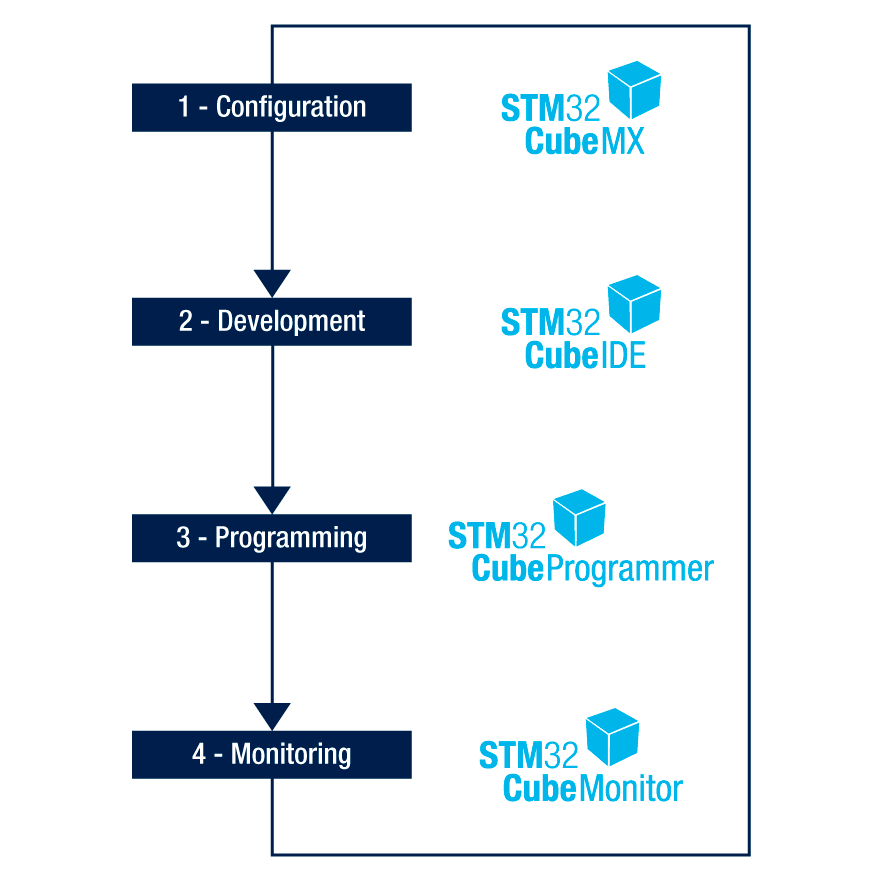
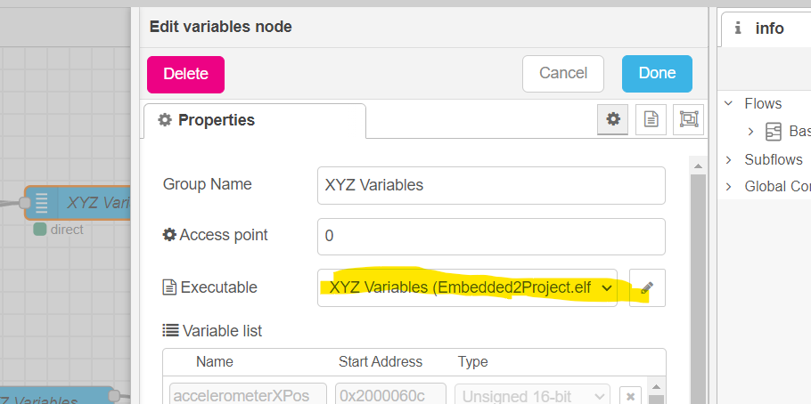
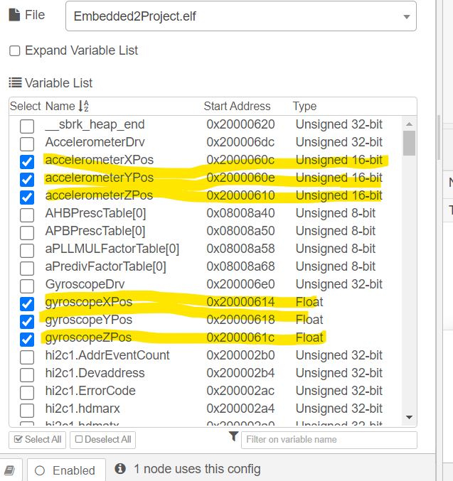
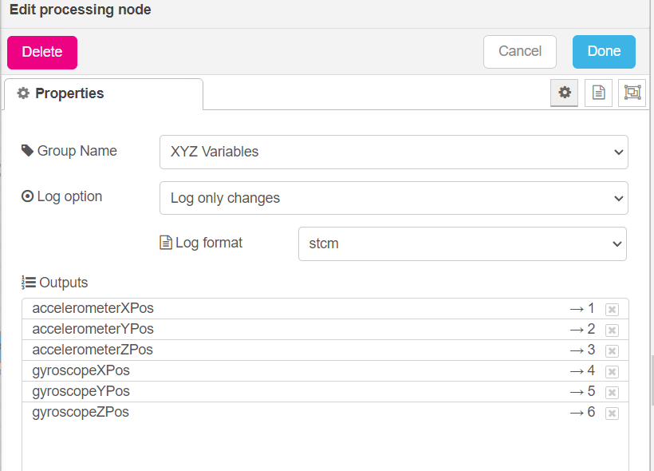
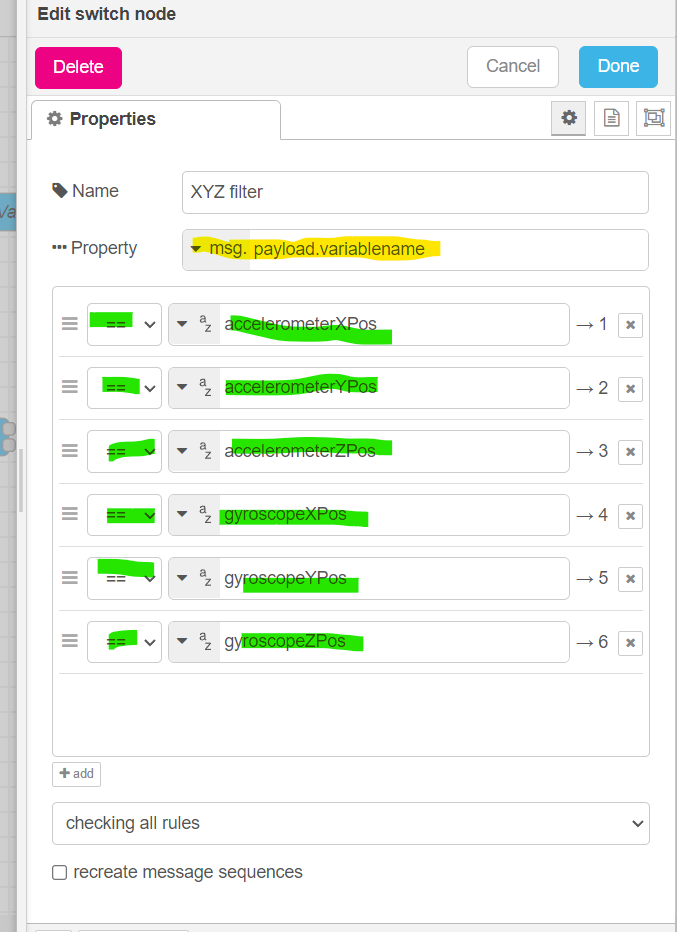
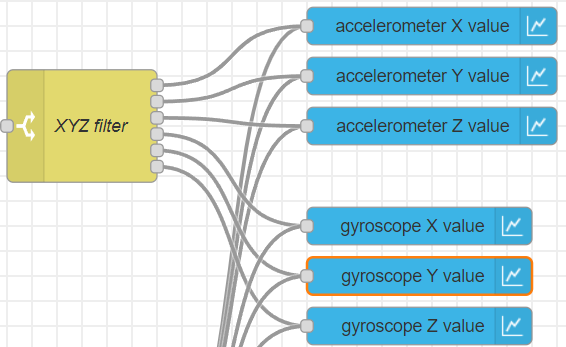
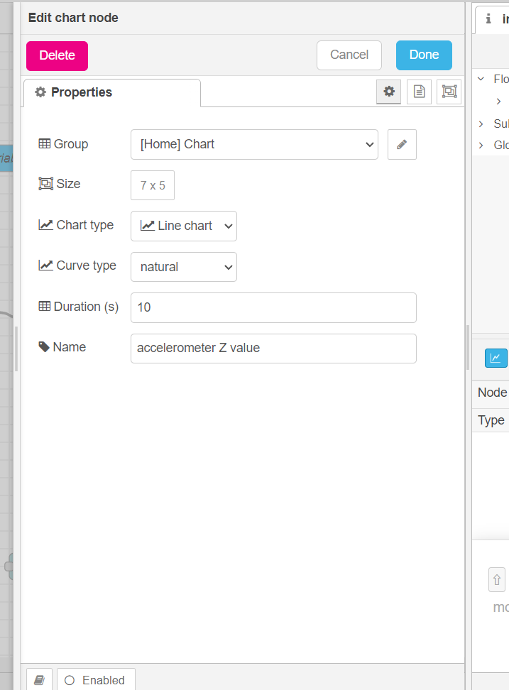
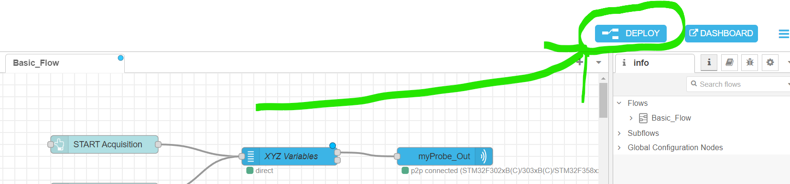
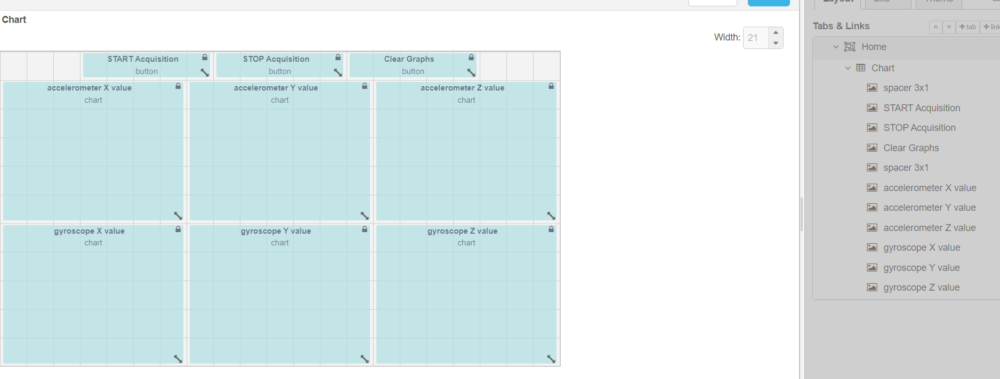
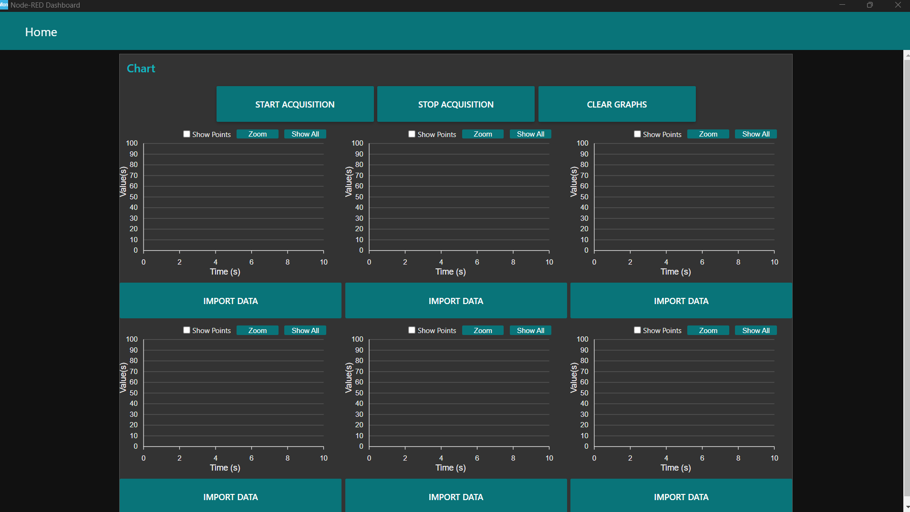

# Monitoring Sensor Outputs with STM32F3Discovery and STM32CubeMonitor

## Table of Contents
1. [Introduction](#introduction)
2. [What is STM32CubeMonitor?](#what-is-stm32cubemonitor)
3. [About the STM32F3Discovery Board](#about-the-stm32f3discovery-board)
4. [Project Objective](#project-objective)
5. [Prequisites](#prerequisites)
6. [Setup and Configuration](#setup-and-configuration) 
7. [Code Implementation](#code-implementation)
8. [Making the Dashboard](#making-the-dashboard)
9. [Result](#result)
10. [Conclusion](#conclusion)

## Introduction
This documentation presents Group 11's Embedded Systems II final project, focusing on the topic of the STM32CubeMonitor software. This project aims to showcase the functionality of the STM32CubeMonitor by creating a simple monitoring application with it.


## What is STM32CubeMonitor?
The STM32CubeMonitor is a real-time diagnostic tool, as well as a flow-based graphical editor for STM32 applications. It facilitating the creation of GUIs, for example, allowing user to easily create custom dashboards with graphs, plots and gauges for easy monitoring of application variables on microcontrollers.


The STM32CubeMonitor is one of four core software components within the STM32Cube ecosystem designed to facilitate development for STM32 microcontrollers.



## About the STM32F3Discovery Board
The [STM32F3Discovery board](https://www.st.com/en/evaluation-tools/stm32f3discovery.html) is a development board based on the stm32f303vct6, featuring 256‑Kbyte of Flash memory and 48‑Kbyte of RAM, as well as the following components: 

- 8 programmable user LEDs
- 1 3-axis digital output gyroscope
- 1 3D digital linear acceleration sensor (accelerometer)
- 1 3D digital magnetic sensor

and many more.


## Project Objective
The main objective of this project is to monitor the outputs of the built-in gyroscope and accelerometer on the microcontroller.
To accomplish this, we will be creating a basic, user-interactable dashboard with graphs that display the outputs of the built-in gyroscope and accelerometer on the microcontroller using the STM32CubeMonitor. 


## Prerequisites
In addition to the STM32CubeMonitor, we will be using the aforementioned STM32F3Discovery board, which serves as the platform for running the STM32 application, and STM32CubeIDE for code development and firmware flashing.

- **Hardware**
   - STM32F3Discovery development board.
- **Software**: 
   - [STM32CubeIDE](https://www.st.com/en/development-tools/stm32cubeide.html) (or any IDE/editor of your choice)
   - [STM32CubeMonitor](https://www.st.com/en/development-tools/stm32cubemonitor.html)

## Setup and Configuration
1. **Setting up the STM32F3Discovery Board**:
   - simply connect the board to your computer. Check if connection is present using **device manager** on Windows or bash command **lsusb** on Linux.
2. **Configuring STM32CubeIDE**:
   - create a new stm32 project and select the stm32f3discovery as the board:
   
   - get the BSP (Board Support Package) software for the STMF3 series [here](https://www.st.com/en/embedded-software/stm32cubef3.html). This software contains libraries such as _stm32f3_discovery_accelerometer.h_ functions that allows us to access the on board accelerometer and gyroscope easily.

## Code Implementation
The full code implementation is included in the repository in the folder stm32cubeIDE.

The following is a snipplet taken from the main.c:
  
  ```c

  // global variables, these variables will be read by the STM32CubeMonitor
  uint16_t accelerometerXPos = 0;
  uint16_t accelerometerYPos = 0;
  uint16_t accelerometerZPos = 0;
  float gyroscopeXPos = 0;
  float gyroscopeYPos = 0;
  float gyroscopeZPos = 0;

  int main(void)
  {

      HAL_Init();

      SystemClock_Config();

      MX_GPIO_Init();
      MX_I2C1_Init();
      MX_SPI1_Init();
      MX_USB_PCD_Init();

      // init gyroscope
      if (BSP_GYRO_Init() != GYRO_OK)
      {
         while (1)
         {
            // something went wrong
         }
      }

      // init accelerometer
      if (BSP_ACCELERO_Init() != ACCELERO_OK)
      {
         while (1)
         {
            // something went wrong
         }
      }

      // data buffers
      int16_t accelerometerBuffer[3];
      float gyroscopeBuffer[3];

      while (1)
      {
         // get gyroscope outputs and save it to the corresponding global variables
         BSP_GYRO_GetXYZ(gyroscopeBuffer);

         gyroscopeXPos = gyroscopeBuffer[0];
         gyroscopeYPos = gyroscopeBuffer[1];
         gyroscopeZPos = gyroscopeBuffer[2];

         // get accelerometer outputs and save it to the corresponding global variables
         BSP_ACCELERO_GetXYZ(accelerometerBuffer);

         accelerometerXPos = accelerometerBuffer[0];
         accelerometerYPos = accelerometerBuffer[1];
         accelerometerZPos = accelerometerBuffer[2];

         HAL_Delay(50);
      }
   }
  ```
  - the BSP_XXX_XXX functions can all be found in the aforementioned BSP API libraries (stm32f3_discovery_accelerometer.h and stm32f3_discovery_gyroscope.h)

  - The outputs of the sensors are getting read and saved in their corresponding global variables. These variables will later be sampled by the STM32CubeMonitor.

## Making the Dashboard
The exact flow diagram used in this project can be found in the folder _flow diagram_. Simply import this json file into STM32CubeMonitor.

1. **Constructing the flow diagram:**
   - using the selection of nodes provided on the task bar on the left, create the following flow diagram:
   
   - The following is the list of nodes we are using for the flow diagram as well as instructions to configure each of the nodes:
      1. **button node** - adds a button to the dash board. 
         - In this example we are using three buttons: _START Acquisition_, _STOP Acquisition_ and _Clear Graphs_.

         - Configure each button by changing the "Topic" attribute in _Properties_ (accessed by double clicking the node) to "start", "stop" and  "clear":
         

      2. **variables node** - user variables to be monitored are declared in this node.
         - specify path to the executable (.elf)
         

         - select the variables we to wish to monitor:
         
      
      3. **acq out/acq in node** - specifies the source (Probe) for input/output data. 
         - Select "ST-Link v2" as the connection Probe and SWD as the protocol on both acq out and acq in: 
         
      
      4. **processing node** - configures processing method of  selected variables.
         - Select group name (name of **variables node**) 
         and log option + format.
          

      5. **switch node** - routes variables to different outputs.
         - In the property attribute, choose "msg." and then append "payload.variablename" to it. This action indicates that each variable is being referenced directly by its name.

         - Create an individual item for each variable, and assign its corresponding name. Choose "==" to specify that an output is created for each variable with variable name == input name. 
          

      6. **chart node** - takes an input variable and plots it against the time at which it was sampled.
         - Create 6 chart nodes for the XYZ outputs of the accelerometer and gyroscope. Connect each of them to their corresponding switch output:
         

         - Select appropriate size and type of chart:
         

   - After completing the flow diagram, simply click on _Deploy_ on the top right corner to generate the dashboard. Make sure that the microcontroller is flashed and connected to the PC.

   

2. **Dashboard Layout**

   - The dashboard layout is customizable through the menu on the right side. Navigate to the "Tabs and Links" section, hover over "Home," and select "layout" This action opens a new tab where you can rearrange the widgets by dragging them to your preferred locations.  
      

Finally click on _Dashboard_ on the top right corner to reveal the dashboard.



## Result
The following gif demonstrates the dashboard in operation. The line charts display the real-time outputs from the accelerometer and gyroscope.


## Conclusion
The project has met its objective, successfully monitoring the outputs of the microcontroller's gyroscope and accelerometer using STM32CubeMonitor. 

The straightforward development of the dashboard underscored STM32CubeMonitor's capacity for data visualization, reinforcing its value as a user-friendly yet powerful tool in embedded system development. 

In our opinion this is an indispensable tool for any embedded projects and we wish to see other companies, like Texas Instruments, develop similar solutions in the future.