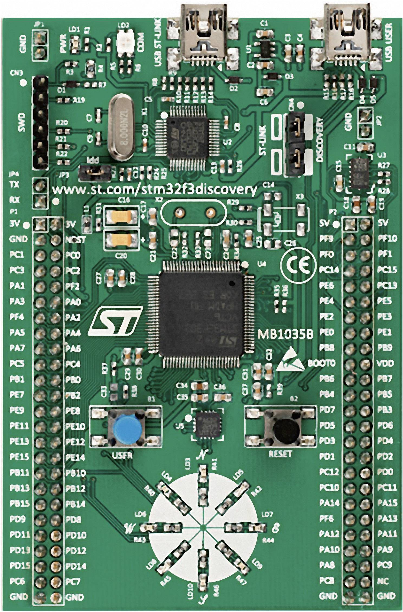
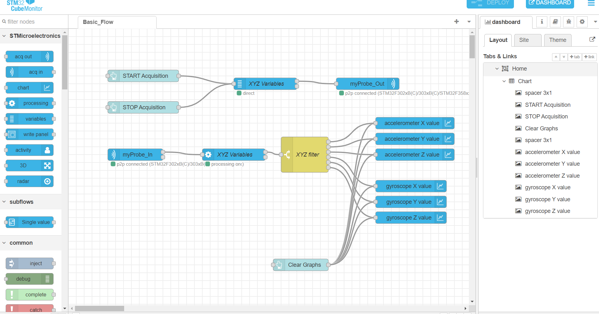

# Monitoring Sensor Outputs with STM32F3Discovery and STM32CubeMonitor

## Table of Contents
1. [Introduction](#introduction)
2. [What is STM32CubeMonitor?](#what-is-stm32cubemonitor)
3. [About the STM32F3Discovery Board](#about-the-stm32f3discovery-board)
4. [Project Objective](#project-objective)
5. [Prequisites](#prerequisites)
6. [Setup and Configuration](#setup-and-configuration) 
7. [Code Implementation](#code-implementation)
8. [Flow Diagram Implementation](#flow-diagram-implementation)
9. [Conclusion](#conclusion)

## Introduction
This documentation presents Group 11's Embedded Systems II project, focusing on the topic of the STM32CubeMonitor software. This project aims to showcase the functionality of the STM32CubeMonitor.


## What is STM32CubeMonitor?
The STM32CubeMonitor is a real-time diagnostic tool, as well as a flow-based graphical editor for STM32 applications. It facilitating the creation of GUIs, for example, allowing user to easily create custom dashboards with graphs, plots and gauges for easy monitoring of application variables on microcontrollers.


## About the STM32F3Discovery Board
The [STM32F3Discovery board](https://www.st.com/en/evaluation-tools/stm32f3discovery.html) is a development board based on the stm32f303vct6, featuring 256‑Kbyte of Flash memory and 48‑Kbyte of RAM, as well as the following components: 

- 8 programmable user LEDs
- 1 3-axis digital output gyroscope
- 1 3D digital linear acceleration sensor (accelerometer)
- 1 3D digital magnetic sensor

and many more.




## Project Objective
The main objective of this project is to monitor the outputs of the built-in gyroscope and accelerometer on the microcontroller.
To accomplish this, we will be creating a basic, user-interactable dashboard with graphs that display the outputs of the built-in gyroscope and accelerometer on the microcontroller using the STM32CubeMonitor. 


## Prerequisites
- **Hardware**
   - STM32F3Discovery development board.
- **Software**: 
   - [STM32CubeIDE](https://www.st.com/en/development-tools/stm32cubeide.html) (or any IDE/editor of your choice)
   - [STM32CubeMonitor](https://www.st.com/en/development-tools/stm32cubemonitor.html)

## Setup and Configuration
1. **Setting up the STM32F3Discovery Board**:
   - simply connect the board to your computer. Check if connection is present using **device manager** on Windows or bash command **lsusb** on Linux.
2. **Configuring STM32CubeIDE**:
   - create a new stm32 project and select the stm32f3discovery as the board:
   
   - get the BSP (Board Support Package) software for the STMF3 series [here](https://www.st.com/en/embedded-software/stm32cubef3.html). This software contains libraries such as _stm32f3_discovery_accelerometer.h_ functions that allows us to access the on board accelerometer and gyroscope easily.

## Code Implementation
The following is a snipplet of the code running on the microcontroller:
  
  ```c

  // global variables, these variables will be read by the STM32CubeMonitor
  uint16_t accelerometerXPos = 0;
  uint16_t accelerometerYPos = 0;
  uint16_t accelerometerZPos = 0;
  float gyroscopeXPos = 0;
  float gyroscopeYPos = 0;
  float gyroscopeZPos = 0;

  int main(void)
  {

      HAL_Init();

      SystemClock_Config();

      MX_GPIO_Init();
      MX_I2C1_Init();
      MX_SPI1_Init();
      MX_USB_PCD_Init();

      // init gyroscope
      if (BSP_GYRO_Init() != GYRO_OK)
      {
         while (1)
         {
            // something went wrong
         }
      }

      // init accelerometer
      if (BSP_ACCELERO_Init() != ACCELERO_OK)
      {
         while (1)
         {
            // something went wrong
         }
      }

      // data buffers
      int16_t accelerometerBuffer[3];
      float gyroscopeBuffer[3];

      while (1)
      {
         // get gyroscope outputs and save it to the corresponding global variables
         BSP_GYRO_GetXYZ(gyroscopeBuffer);

         gyroscopeXPos = gyroscopeBuffer[0];
         gyroscopeYPos = gyroscopeBuffer[1];
         gyroscopeZPos = gyroscopeBuffer[2];

         // get accelerometer outputs and save it to the corresponding global variables
         BSP_ACCELERO_GetXYZ(accelerometerBuffer);

         accelerometerXPos = accelerometerBuffer[0];
         accelerometerYPos = accelerometerBuffer[1];
         accelerometerZPos = accelerometerBuffer[2];

         HAL_Delay(50);
      }
   }
  ```
  - the BSP_XXX_XXX functions can all be found in the aforementioned BSP API libraries (stm32f3_discovery_accelerometer.h and stm32f3_discovery_gyroscope.h)

  - The outputs of the sensors are getting read and saved in their corresponding global variables. These variables will later be sampled by the STM32CubeMonitor.

## Flow Diagram Implementation
**Configuring STM32CubeMonitor**:
   - using the selection of nodes provided on the left side of the application, create the following flow diagram:
   

## Conclusion